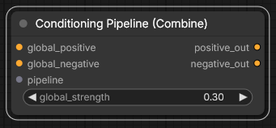
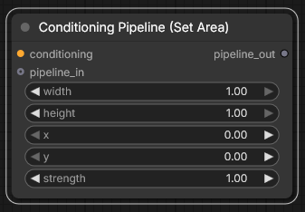
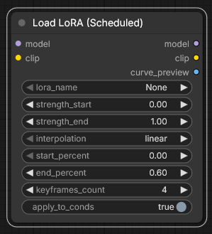
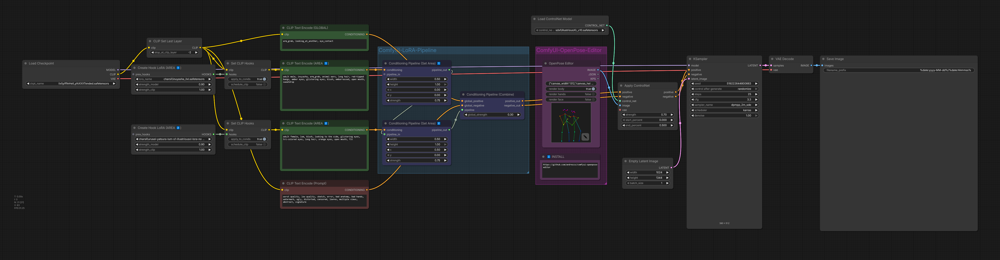
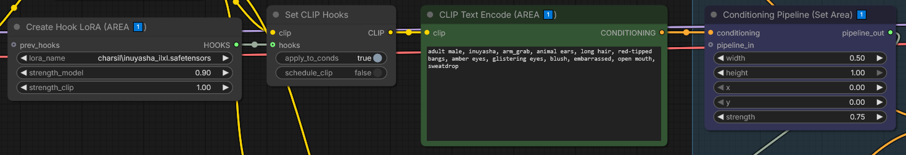
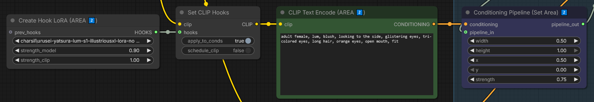
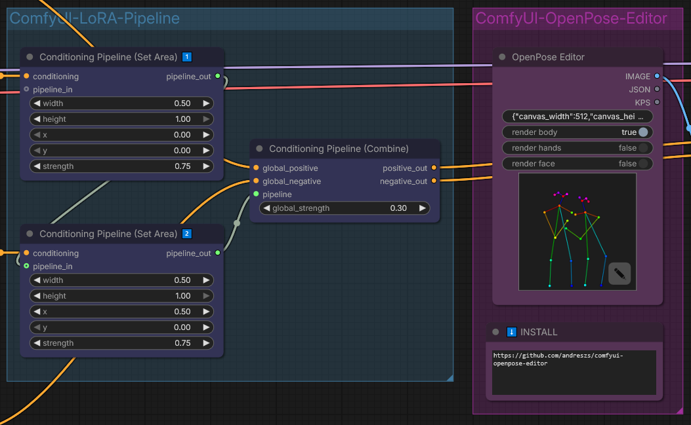

<h4 align="center">
  <a href="./README.md">English</a> | <a href="./README.de.md">Deutsch</a> | <a href="./README.es.md">Español</a> | Français | <a href="./README.pt.md">Português</a> | <a href="./README.ru.md">Русский</a> | <a href="./README.ja.md">日本語</a> | <a href="./README.ko.md">한국어</a> | <a href="./README.zh.md">中文</a> | <a href="./README.zh-TW.md">繁體中文</a>
</h4>


<p align="center">
  
  
  
</p>
<br />

# ComfyUI LoRA Pipeline

Wrappers de conditionnement LoRA basés sur la zone et nœuds de planification LoRA pour ComfyUI.

---

## Table des matières

- ✨ [Caractéristiques](#features)
- 📦 [Installation](#installation)
- ✅ [Configuration recommandée (multi-zones / multi-sujets)](#recommended-setup-multi-area--multi-subject)
- 🔧 [Nœuds](#nodes)
  - [Conditioning Pipeline (Set Area)](#conditioning-pipeline-set-area)
  - [Conditioning Pipeline (Combine)](#conditioning-pipeline-combine)
  - [ScheduledLoRALoader](#scheduledloraloader)
- 🧩 [Dépendances facultatives](#optional-dependencies)
- 🧭 [Exemple de workflow multi-zones](#example-workflow-multi-area-conditioning-pipeline)
- 🖼️ [Galerie](#gallery)
- 🚀 [Journal des modifications](#changelog)
- 💙 [Financement et soutien](#funding--support)
- 📄 [Licence](#license)

---

## <a id="features"></a>Caractéristiques

- Pipeline de conditionnement basé sur la zone pour les invites multi-sujets et multi-régions.
- Contrôle de force LoRA planifié à un nœud avec une sortie d'aperçu de courbe.
- Pour une composition multi-sujets cohérente dans plusieurs domaines, **ControlNet + OpenPose est fortement recommandé** via [comfyui-openpose-studio](https://github.com/andreszs/comfyui-openpose-studio).
- Sans ControlNet/OpenPose, la composition multi-sujets et multi-zones est souvent incohérente et peut nécessiter de nombreuses tentatives.
- Python uniquement : aucune dépendance JavaScript ou frontend requise.

---

## <a id="installation"></a>Installation

### Exigences
- ComfyUI (version récente)
- Python3.10+
- Dépendances facultatives par nœud : `matplotlib`

### Étapes

1. Clonez ce référentiel dans `ComfyUI/custom_nodes/`.
2. Redémarrez ComfyUI.
3. Confirmez que les nœuds apparaissent sous `LoRA Pipeline/`.

---

## <a id="recommended-setup-multi-area--multi-subject"></a>Configuration recommandée (multi-zones / multi-sujets)

- Utilisez ControlNet OpenPose (recommandé) : [comfyui-openpose-studio](https://github.com/andreszs/comfyui-openpose-studio).
- Gardez l’invite globale minimale et générale.
- Gardez `global_strength` bas (règle générale : en dessous de `0.5`).
- Équilibrez la force par zone, la force `global_strength` et la force LoRA ; ne maximisez pas toutes les forces.
- Exemples de valeurs de référence qui ont bien fonctionné : forces de zone autour de `0.75`, forces de LoRA autour de `0.90`.

---

## <a id="nodes"></a>Nœuds

| Conditioning Pipeline (Combine) | Conditioning Pipeline (Set Area) | Load LoRA (Scheduled) |
|---|---|---|
|  |  |  |

### <a id="conditioning-pipeline-set-area"></a>Conditioning Pipeline (Set Area)

Définissez une entrée conditionnée par zone à la fois. Ce nœud définit une région rectangulaire avec une largeur, une hauteur, x et y, puis applique une invite et une force de conditionnement dédiées à cette région dans le cadre d'un pipeline de conditionnement en chaîne.

**En un coup d'oeil :**
- Utilisez une instance de nœud par invite de région/sujet.
- Chaînez plusieurs instances pour créer un pipeline de conditionnement régional.
- Permet un contrôle multi-sujets propre avant la combinaison finale.

**Entrée :**
- `conditioning` (`CONDITIONING`, obligatoire)
- `width`, `height`, `x`, `y` (`FLOAT`, normalisé `0.0-1.0`)
- `strength` (`FLOAT`, par défaut `1.0`)
- `pipeline_in` (`CONDITIONING_PIPELINE`, facultatif)

**Sorties :**
- `pipeline_out` (`CONDITIONING_PIPELINE`)

**Remarques sur le comportement :**
- Crée un nouveau pipeline si `pipeline_in` n'est pas connecté.
- Ajoute une nouvelle entrée régionale lorsque `pipeline_in` est connecté.
- Maintient les entrées ordonnées afin que vous puissiez créer des piles régionales prévisibles.
- Des intensités de zone inférieures améliorent souvent la qualité globale de l’image, mais réduisent l’autorité de contrôle par zone.
- Équilibrez la force de la zone avec global_strength et la force LoRA dans Create Hook Lora.

**Erreurs courantes :**
- Fournir des coordonnées de pixels au lieu de valeurs `0.0-1.0` normalisées.
- Régler `width`/`height` près de `0` et attendre un effet visible.
- Oublier de passer le pipeline final dans `Conditioning Pipeline (Combine)`.

---

### <a id="conditioning-pipeline-combine"></a>Conditioning Pipeline (Combine)

Combinez le conditionnement global positif/négatif avec le pipeline régional pour obtenir des résultats adaptés à la région. Avec Set Area, il s'agit du chemin principal pour les multi-LoRA et les conditionnements séparés par sujet/zone.

**En un coup d'oeil :**
- Convertit votre pipeline régional en résultats finaux positifs/négatifs.
- Conserve le contexte d'invite global tout en ajoutant un contrôle régional local.

**Entrée :**
- `global_positive` (`CONDITIONING`, obligatoire)
- `global_negative` (`CONDITIONING`, obligatoire)
- `pipeline` (`CONDITIONING_PIPELINE`, obligatoire)
- `global_strength` (`FLOAT`, par défaut `0.3`)
- `fast_mode` (`BOOLEAN`, par défaut `false`)

**Sorties :**
- `positive_out` (`CONDITIONING`)
- `negative_out` (`CONDITIONING`)
- `areas_out` (`CONDITIONING_AREAS`)

**Détails sur `areas_out` :**

`areas_out` expose la liste des régions de zone configurées sous forme de sortie de données structurées. Chaque entrée contient les coordonnées normalisées (`x`, `y`, `width`, `height`) et `strength` définies dans le pipeline via `Conditioning Pipeline (Set Area)`. Connectez `areas_out` à [ComfyUI-OpenPose-Studio](https://github.com/andreszs/comfyui-openpose-studio) pour refléter automatiquement vos zones de conditionnement dans l'éditeur OpenPose — le placement des poses s'alignera sur les régions exactes que vous avez conditionnées. Cette sortie peut également être consommée par toute autre extension ou nœud acceptant des métadonnées de zone pour la génération de masques ou le traitement en aval sensible aux régions.

**Remarques sur le comportement :**
- Si le pipeline est vide/invalide, les sorties reviennent aux entrées globales et `areas_out` est une liste vide.
- Applique les entrées régionales, puis une passe de combinaison par défaut pour les régions non couvertes.
- `global_strength` contrôle la mesure dans laquelle le contexte mondial entre en concurrence avec les zones locales.
- Pousser global_strength trop haut peut réduire l'influence du conditionnement par zone et avoir un impact négatif sur la qualité de l'image.
- Les bons résultats proviennent généralement d'un équilibre entre la force globale, la force par zone et la force LoRA plutôt que de maximiser toutes les valeurs.
- `fast_mode` est facultatif et désactivé par défaut, afin que les workflows existants conservent leur comportement précédent.
- Lorsqu'il est activé, Fast Mode concatène le conditionnement positif global à chaque conditionnement positif régional. `global_strength` n'est pas ignoré : il met uniquement à l'échelle la partie globale ajoutée.
- Lorsque les régions configurées couvrent tout le canevas, Fast Mode évite une passe positive globale séparée. Si la couverture est incomplète, le fallback global est conservé et l'accélération sera donc moindre.
- Fast Mode n'est pas mathématiquement identique au chemin standard et peut modifier l'équilibre du prompt, la composition ou la fidélité des sujets. Comparez les résultats avant de l'utiliser en production.

**Erreurs courantes :**
- Nourrir un seul flux de conditionnement au lieu d’un flux positif et négatif.
- Surconduite de `global_strength` et effacement des détails de la zone.
- Construire les entrées de la zone mais en oubliant de connecter les sorties combinées au chemin de votre échantillonneur.

---

### <a id="scheduledloraloader"></a>ScheduledLoRALoader

Appliquez un LoRA avec une force constante ou une courbe programmée au fil de la progression de la diffusion, dans un nœud propre.

**En un coup d'oeil :**
- Remplace les chaînes désordonnées de plusieurs nœuds natifs LoRA/control.
- Conserve le timing, l'interpolation et l'aperçu ensemble.
- Câblage graphique plus propre pour le comportement temporel LoRA.

**Entrée :**
- `model` (`MODEL`, obligatoire)
- `clip` (`CLIP`, obligatoire)
- `lora_name` (`STRING`, obligatoire)
- `strength_start`, `strength_end` (`FLOAT`)
- `interpolation` (`STRING` : `linear`, `ease_in`, `ease_out`, `ease_in_out`)
- `start_percent`, `end_percent` (`FLOAT`, `0.0-1.0`)
- `keyframes_count` (`INT`, par défaut `4`)
- `apply_to_conds` (`BOOLEAN`, facultatif)

**Sorties :**
- `model` (`MODEL`)
- `clip` (`CLIP`)
- `curve_preview` (`IMAGE`)

**Remarques sur le comportement :**
- Si `lora_name` est `None`, le modèle/clip est transmis et l'aperçu est toujours rendu.
- Si les forces de début et de fin correspondent, elle se comporte comme une application LoRA constante.
- L'aperçu des courbes permet de vérifier rapidement le timing avant les rendus complets.

**Erreurs courantes :**
- Oublier `matplotlib` lors de l'utilisation de `curve_preview`.
- Utilisation d'une fenêtre de planification qui ne correspond pas à l'intention de synchronisation de l'échantillonneur.
- On s'attend à ce que ce nœud génère directement `CONDITIONING`.

---

## <a id="optional-dependencies"></a>Dépendances facultatives

Installez uniquement ce dont vous avez besoin, dans le même environnement Python utilisé par ComfyUI.

- Aperçu de la courbe `ScheduledLoRALoader` : `python -m pip install matplotlib`

---

## <a id="example-workflow-multi-area-conditioning-pipeline"></a>Exemple de workflow multi-zones

[](../workflows/conditioninig_pipeline_area_wf.png)

Vous pouvez glisser-déposer cette image de flux de travail dans ComfyUI pour importer/charger le graphique complet.

#### Configuration de la zone 1

[](../assets/conditioninig_area_1.png)

- Utilisez `Create Hook Lora` natif pour charger un LoRA et définir l'invite/le conditionnement de zone pour la zone 1.
- Connectez ce conditionnement à `Conditioning Pipeline (Set Area)` et définissez `width`, `height`, `x`, `y` et `strength` pour cette région.

#### Configuration de la zone 2

[](../assets/conditioninig_area_2.png)

- Répétez exactement le même schéma : un autre `Create Hook Lora` + un autre `Conditioning Pipeline (Set Area)`.
- Vous pouvez continuer à répéter ce modèle pour des zones supplémentaires.

#### Enchaînement des pipelines et combinaison

[](../assets/conditioning_combine.png)

- Chaînez `pipeline_out` de la zone 1 vers la zone 2 (entrées de pipeline concaténées).
- Envoyez `pipeline_out` de la dernière zone vers `Conditioning Pipeline (Combine)`, qui fusionne le pipeline de zone avec le conditionnement global.
- Acheminez la sortie combinée directement vers `KSampler` ou vers `ControlNet` ; dans cet exemple, il est acheminé vers `ControlNet`.

#### OpenPose / ControlNet conseils

- OpenPose/ControlNet est facultatif en général, mais pour ce flux de travail de composition multi-sujets et multi-zones spécifique, il est fortement recommandé pour une composition cohérente.
- Voir [comfyui-openpose-studio](https://github.com/andreszs/comfyui-openpose-studio) du même auteur (dépôt plus récent).

#### Emplacement global `Styler Pipeline`

[](../assets/styler_pipeline_node.png)

Le style global signifie appliquer `Styler Pipeline` une fois à l'image entière, en plus (ou à la place) du conditionnement par zone.

- Règle générale : connectez `Styler Pipeline` avant `KSampler`.
- Lorsque vous utilisez ControlNet, `Styler Pipeline` peut être connecté soit avant d'appliquer ControlNet, soit après avoir appliqué ControlNet.
- En pratique, le résultat est généralement équivalent, alors choisissez l'emplacement le plus pratique dans votre graphique.

#### `global_strength` compromis

- Augmenter trop `global_strength` réduit l’influence relative des conditionnements par zone et peut affaiblir l’identité LoRA/style par zone.
- Une résistance globale plus élevée peut également avoir un impact négatif sur la qualité de l’image.
- Gardez `global_strength` bas et gardez l'invite globale minimale/générale.
- Règle générale : utilisez des valeurs inférieures à `0.5` en général (testées jusqu'à `0.5`) et évitez de vous fier à un conditionnement global au-delà des conseils généraux.
- Réduire la force de LoRA a tendance à réduire l'identité de LoRA ou la fidélité du personnage, tandis que réduire la force de la zone a tendance à réduire le contrôle par zone.
- Il n'est pas recommandé de tout maximiser, car des forces combinées élevées peuvent sacrifier la qualité de l'image. Cela est particulièrement vrai lorsque vous mélangez des LoRA de différents auteurs, ce qui peut produire une qualité incohérente.
- Règle générale pour les LoRA à plusieurs caractères : lorsque cela est possible, utilisez les LoRA du même auteur ou une approche de formation similaire pour des résultats combinés plus cohérents.

---

## <a id="gallery"></a>Galerie

| Aperçu | Description |
|---------|-------------|
| [](../workflows/conditioninig_pipeline_area.png) | **Pipeline de conditionnement — Zones multiples avec ControlNet OpenPose**<br><br>Démontre plusieurs zones verticales avec plusieurs LoRA sans saignement LoRA, en utilisant ControlNet OpenPose.<br><br>Nécessite [comfyui-openpose-studio](https://github.com/andreszs/comfyui-openpose-studio). |
| [](../workflows/conditioninig_pipeline_styled.png) | **Pipeline de conditionnement — Zones multiples avec ControlNet et style**<br><br>Démontre plusieurs zones et plusieurs LoRA avec un style par zone appliqué à chaque région indépendamment.<br><br>Nécessite [comfyui-openpose-studio](https://github.com/andreszs/comfyui-openpose-studio) et [comfyui-styler-pipeline](https://github.com/andreszs/comfyui-styler-pipeline).<br><br>Ce flux de travail utilise style par zone, ce qui signifie que chaque zone a ses propres styles configurés séparément. Le style global est également possible en connectant le nœud Styler juste avant ControlNet. |

Consultez [cet article](https://www.andreszsogon.com/building-a-multi-character-comfyui-workflow-with-area-conditioning-openpose-control-and-style-layering/) pour un workflow complet combinant plusieurs zones de conditioning, OpenPose, ControlNet et Styler utilisés simultanément.

---

## <a id="changelog"></a>Journal des modifications

### 1.1.4

- L'optimisation du conditionnement régional a réduit le temps de génération mesuré d'environ 144 à 70 secondes dans un workflow SDXL testé avec deux régions, soit environ 51 % de temps de rendu en moins.
- Le Fast Mode facultatif a terminé un test équivalent avec couverture complète en environ 54 secondes, soit jusqu'à environ 63 % de temps en moins que l'implémentation précédente.
- Les performances varient selon le GPU, le modèle, la résolution, le sampler, la configuration ControlNet et la couverture régionale. Fast Mode peut également produire des différences visuelles et reste donc désactivé par défaut.

---

## <a id="funding--support"></a>Financement et soutien

### Pourquoi votre soutien est important

Ce plugin est développé et maintenu de manière indépendante, avec l'utilisation régulière d'**agents IA payants** pour accélérer le débogage, les tests et les améliorations de la qualité de vie. Si vous le trouvez utile, le soutien financier contribue à maintenir le développement de manière régulière.

Votre contribution aide :

* Financez les outils d’IA pour des correctifs plus rapides et de nouvelles fonctionnalités
* Couvrir les travaux de maintenance et de compatibilité en cours sur les mises à jour ComfyUI
* Empêcher les ralentissements de développement lorsque les limites d'utilisation sont atteintes

> [!TIP]
> Vous ne faites pas de don ? Une star de GitHub ⭐ aide toujours beaucoup en améliorant la visibilité et en aidant davantage d'utilisateurs

### 💙 Soutenez ce projet

<table style="width: 100%; table-layout: fixed;">
  <tr>
    <td align="center" style="width: 33.33%; padding: 20px;">
      <div>
        <h4 style="margin: 8px 0;">Ko-fi</h4>
        <a href="https://ko-fi.com/D1D716OLPM" target="_blank" rel="noopener noreferrer">
          
        </a>
        <p style="margin: 8px 0; font-size: 12px;"><a href="https://ko-fi.com/D1D716OLPM" target="_blank" rel="noopener noreferrer">Acheter un café</a></p>
      </div>
    </td>
    <td align="center" style="width: 33.33%; padding: 20px;">
      <div>
        <h4 style="margin: 8px 0;">PayPal</h4>
        <a href="https://www.paypal.com/ncp/payment/GEEM324PDD9NC" target="_blank" rel="noopener noreferrer">
          
        </a>
        <p style="margin: 8px 0; font-size: 12px;"><a href="https://www.paypal.com/ncp/payment/GEEM324PDD9NC" target="_blank" rel="noopener noreferrer">Ouvrir PayPal</a></p>
      </div>
    </td>
    <td align="center" style="width: 33.33%; padding: 20px;">
      <div>
        <h4 style="margin: 8px 0;">USDC (Arbitrum uniquement ⚠️)</h4>
        <a href="https://arbiscan.io/address/0xe36a336fC6cc9Daae657b4A380dA492AB9601e73" target="_blank" rel="noopener noreferrer">
          
        </a>
        <p style="margin: 8px 0; font-size: 12px;"><a href="#usdc-address">Afficher l'adresse</a></p>
      </div>
    </td>
  </tr>
</table>

<details>
  <summary>Vous préférez numériser ? Afficher les codes QR</summary>
  <br />
  <table style="width: 100%; table-layout: fixed;">
    <tr>
      <td align="center" style="width: 33.33%; padding: 12px;">
        <strong>Ko-fi</strong><br />
        <a href="https://ko-fi.com/D1D716OLPM" target="_blank" rel="noopener noreferrer">
          
        </a>
      </td>
      <td align="center" style="width: 33.33%; padding: 12px;">
        <strong>PayPal</strong><br />
        <a href="https://www.paypal.com/ncp/payment/GEEM324PDD9NC" target="_blank" rel="noopener noreferrer">
          
        </a>
      </td>
      <td align="center" style="width: 33.33%; padding: 12px;">
        <strong>USDC (Arbitrum) ⚠️</strong><br />
        <a href="https://arbiscan.io/address/0xe36a336fC6cc9Daae657b4A380dA492AB9601e73" target="_blank" rel="noopener noreferrer">
          
        </a>
      </td>
    </tr>
  </table>
</details>

<a id="usdc-address"></a>
<details>
  <summary>Afficher l'adresse de USDC</summary>

```text
0xe36a336fC6cc9Daae657b4A380dA492AB9601e73
```

> [!WARNING]
> Envoyez USDC uniquement sur Arbitrum One. Les transferts envoyés sur tout autre réseau n’arriveront pas et pourront être définitivement perdus.
</details>

## <a id="license"></a>Licence

Licence MIT - voir [LICENSE](../LICENSE) pour le texte intégral.

---

**Entretenu par :** andreszs
**Statut :** Développement actif
